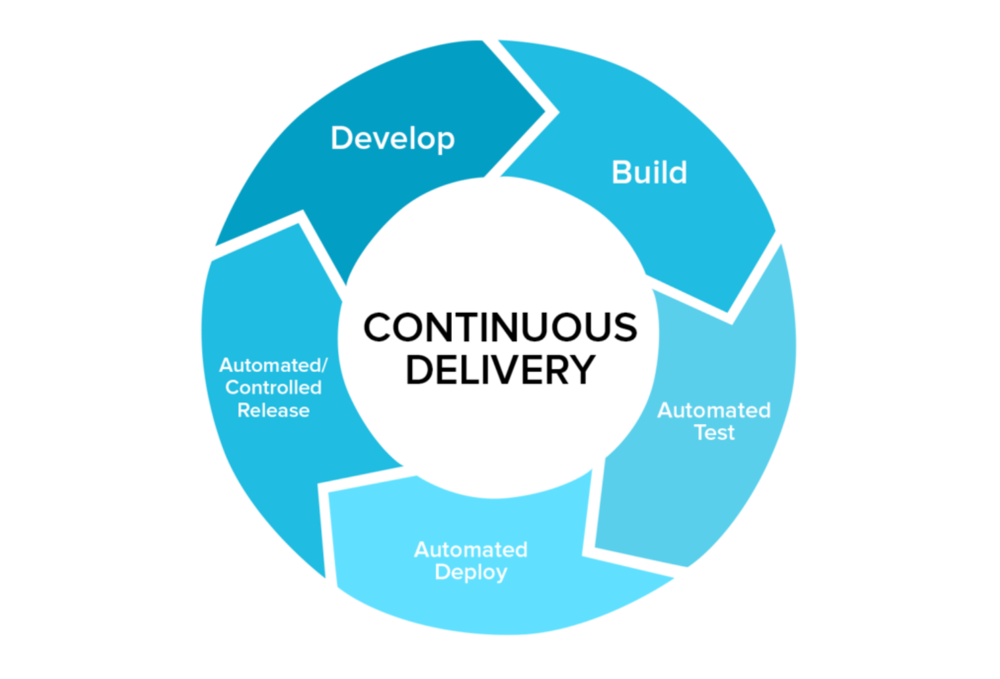
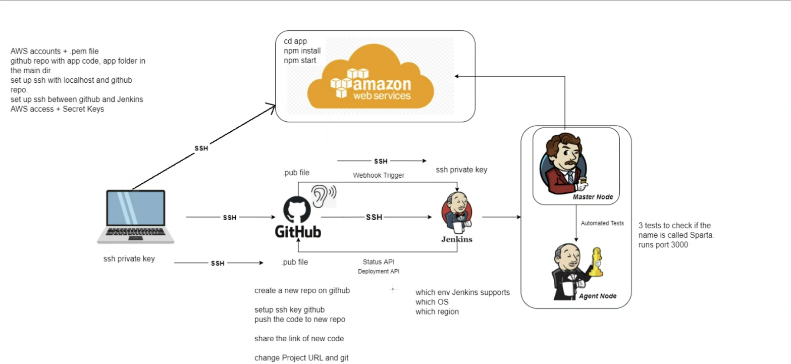
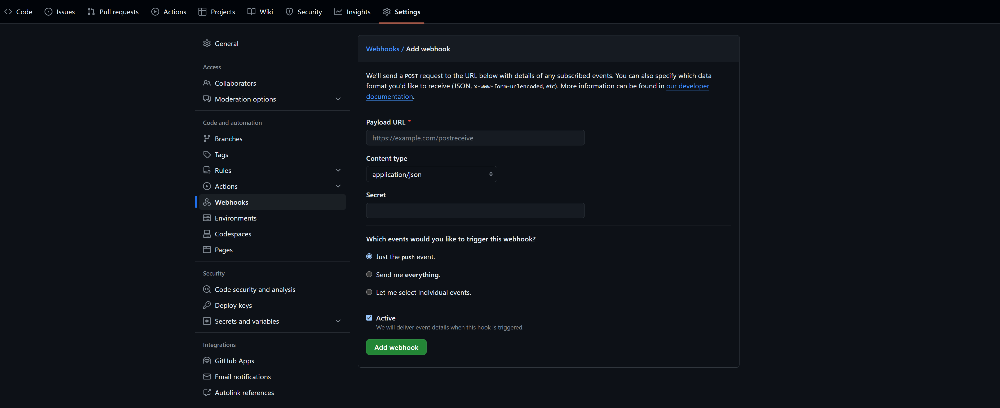
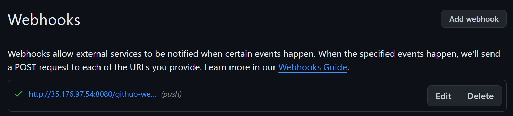

-   [What is CI/CD?](#what-is-cicd)
    -   [Continuous Integration (CI)](#continuous-integration-ci)
    -   [Continuous Delivery (CD)](#continuous-delivery-cd)
-   [Why use CI/CD?](#why-use-cicd)
-   [When is CI/CD useful?](#when-is-cicd-useful)
-   [Where is CI/CD used?](#where-is-cicd-used)
-   [How does CI/CD work?](#how-does-cicd-work)
-   [Integrating GitHub Webhooks to a Jenkins Pipeline](#integrating-github-webhooks-to-a-jenkins-pipeline)
    -   [Prerequisites](#prerequisites)
    -   [Create a Jenkins Job](#create-a-jenkins-job)

## What is CI/CD?

CI/CD, or Continuous Integration/Continuous Delivery, is a practice in DevOps that aims to improve software development and deployment processes, mainly by making them much faster.

### Continuous Integration (CI)

-   Developers frequently merge their code changes into a central repository.
-   Each merge triggers an automated build and testing process.
-   Provides immediate feedback to the team.
-   Can identify bugs early and save time through automation.

### Continuous Delivery (CD)

-   Getting the updated app to users quickly and smoothly.
-   The app is always ready to be sent to users, but someone has to decide when to do it.
-   The app is sent to users automatically whenever it passes all the tests.

## Why use CI/CD?

-   To speed up the release process.
-   To catch and fix errors quickly.
-   To improve the quality of software.
-   To reduce manual work in testing and deploying software.

## When is CI/CD useful?

-   When you have a team of developers working on the same project.
-   When you want to release updates to your app quickly and smoothly.
-   When you want to make sure your app is always working correctly and passing tests.
-   When you want to reduce the time and effort spent on testing and deploying software.

## Where is CI/CD used?

-   In software development teams that want to improve their processes.
-   In companies that want to release updates to their apps quickly and automatically.

## How does CI/CD work?

Using an example of a simple CI/CD pipeline with Jenkins, GitHub, and AWS:

-   Developers write code on their computers and send it to GitHub, which stores the code online.
-   When new code is sent to GitHub, Jenkins automatically takes the code and runs tests to make sure it works.
-   If the tests pass, Jenkins can then send the updated code to AWS, which makes it available to users online.
-   If the tests fail, Jenkins lets the developers know so they can fix the problems.
-   The app is constantly being improved, tested, and made available to users, all with minimal manual work. It helps teams work together better and keeps the quality of the app high.

## Integrating GitHub Webhooks to a Jenkins Pipeline

### Prerequisites

-   [x] Jenkins installed and available on the internet.
-   [x] Jenkins GitHub plugin installed.
-   [x] GitHub Repository

### Create a Jenkins Job

-   Click 'New Item' on the Jenkins dashboard.
-   Enter a name for the job and select 'Freestyle project'.
-   Provide the GitHub project URL in the 'General' section.

-   In the 'Source Code Management' section, select 'Git' and provide the SSH repository URL.
-   Add the private SSH key to the credentials part.
-   Specify the branch to use.

